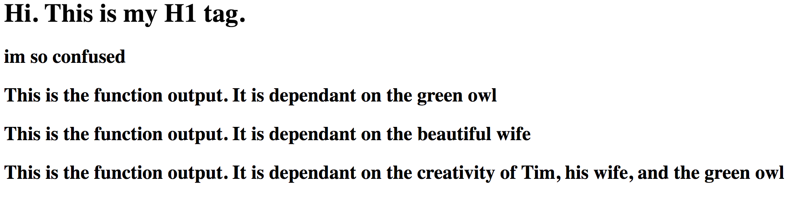

# JavaScript Functions 

This project is an exploration of javascript functions.  I built an animal nuggetizer.  I also printed some numbers to the DOM.


## Screenshots 


## How to run this project
* Use npm to install http-server in your terminal:
```sh
npm install -g http-server
```
* Run the server in your terminal (if you asign a number, make it higher than 3000, but not 8080):
```sh
hs -p 9999
```
*open Chrome and navigate to: 
```
localhost:9999
```